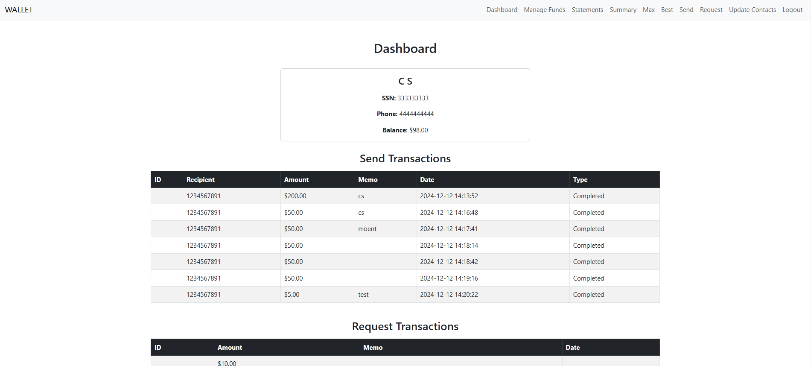
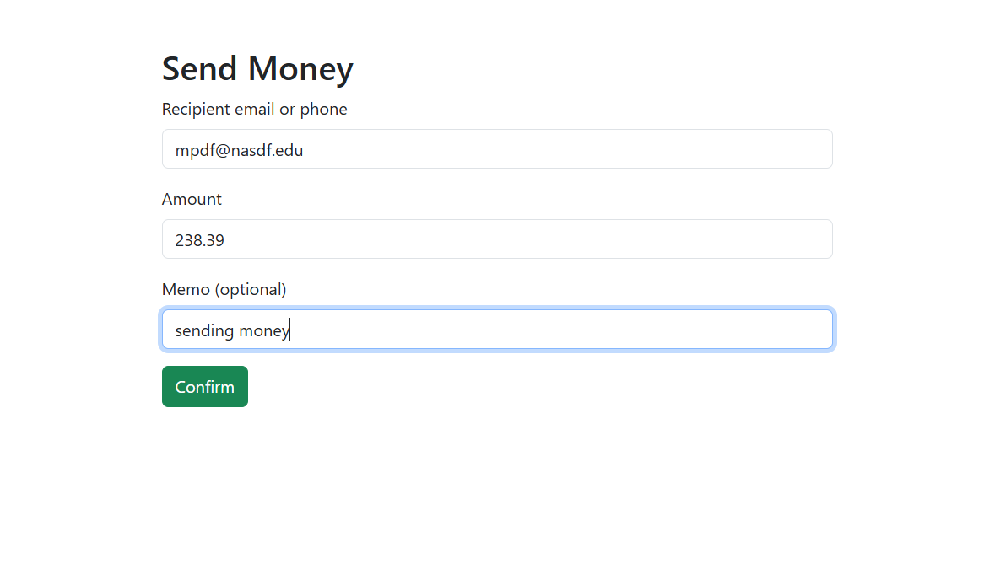
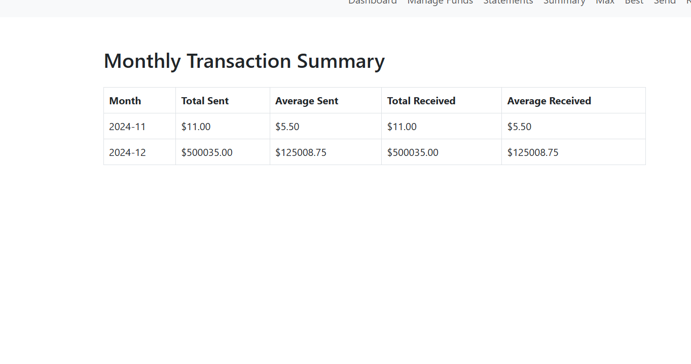
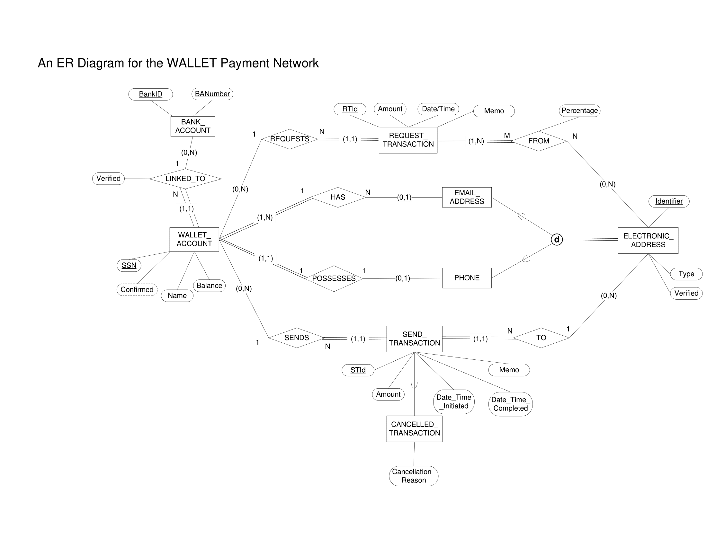
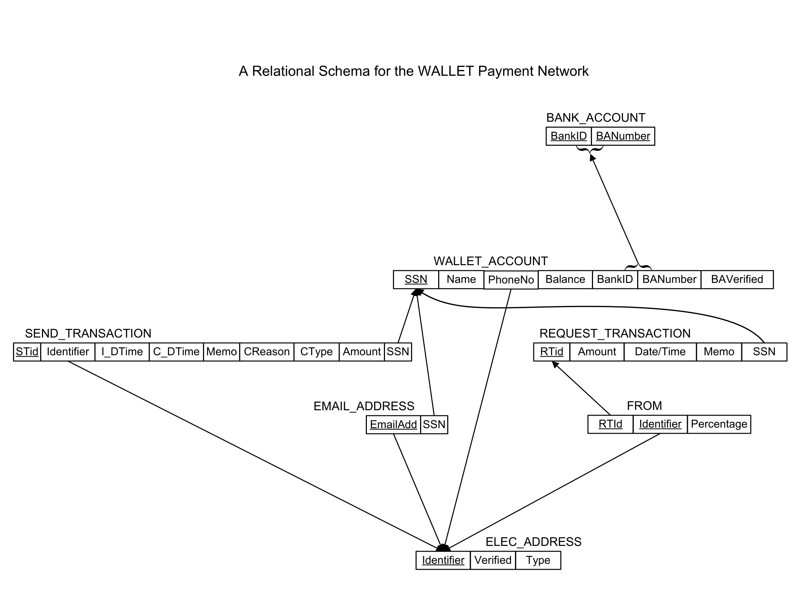

# Wallet-Network

## Project Overview
**Wallet-Network** is a digital wallet application developed for the CS631 course. The system enables users to manage their accounts, perform electronic transactions (send and request), and link external bank accounts. The application is built using Flask for the backend, MySQL for the database, and HTML/Bootstrap for the frontend. It demonstrates the implementation of a robust and scalable payment network.

## Features
### Backend Features
- **User Signup/Login**: Input validation for SSN, email, and phone number, and authentication via SSN.
- **Dashboard**: Displays user details, wallet balance, and transaction history.
- **Fund Management**: Allows users to add or withdraw funds from their wallet.
- **Transactions**:
  - Send money with validation and database updates.
  - Request funds from other users.
- **Bank Integration**: Link and unlink bank accounts.

### Frontend Features
- Responsive and interactive HTML templates styled with Bootstrap.
- A user-friendly dashboard displaying:
  - User details (name, SSN, phone number, balance, etc).
  - Recent transactions, including sent and requested payments.

## Demo
**Dashboard**: A centralized interface that displays user details, wallet balance, and recent transaction history.


**Send Money**: A form to transfer funds to other users with recipient validation and real-time transaction updates.


**Monthly Statement**: A brief overview of the user's transactions categorized by month.


## Data Integration
### Overview
The database for Wallet-Network is hosted on MySQL. It is crucial to ensure the database is running and accessible from the application. The database must be properly configured with the schema and tables created using the provided SQL scripts. Ensure that the MySQL server is accessible from the network where the application is hosted.

The `db.py` file handles database connectivity and query execution. To establish a connection, use the following parameter configuration and adjust accordingly:
- **Host**: `<192.168.0.1>`
- **Port**: `3306`
- **Database Name**: `wallet_network`
- **Username**: `user`

## Database Code
The `db.py` file is responsible for managing database connectivity and executing queries. Below is a brief overview of its components:

- **`get_db_connection()`**: Establishes a connection to the MySQL database using the credentials provided. Ensures the connection is live before returning it.
- **`execute_query(query, params=None)`**: Executes a non-select SQL query (e.g., INSERT, UPDATE, DELETE) with optional parameters and commits the transaction.
- **`fetch_query(query, params=None)`**: Executes a SELECT query with optional parameters and fetches all the results as a list of dictionaries.
- 
## Entity-Relationship Diagram
The ER diagram illustrates the relationships between key entities in the Wallet-Network database.



## Relational Schema
The relational schema provides a detailed view of the database structure.



### Notes:
- If the database is not running or accessible, the application will raise an exception with a clear error message.
- Ensure the database credentials in `db.py` match your environment or update them before running the application.
- Example error handling:
  - If the database is unreachable, the following error will be displayed: `Database connection error: <Error details>`

## Installation and Setup
### Prerequisites
- Python 3.8+
- Flask
- MySQL
- Bootstrap (via CDN or locally installed)
- PHPMyAdmin (optional, for managing the database)

### Steps to Set Up
1. Clone the repository:
```
git clone https://github.com/your-repo/Wallet-Network.git
cd Wallet-Network
```

2. Set up the MySQL database:
- Use the `CREATE TABLE` SQL scripts provided in the [`queries.sql`](queries.sql) file.
- Populate the database with the sample data in the `INSERT` scripts.

3. Configure `db.py`:
- Ensure the database host, port, name, and user credentials in `db.py` are correctly set to match your MySQL server.

4. Install Python dependencies:
```
pip install -r requirements.txt
```

5. Start the Flask application:
```
flask run
```

6. Access the application at `http://127.0.0.1:5000` or `localhost:5000`.

## Usage
### User Workflow
1. **Signup**: Register using SSN, email, and phone number.
2. **Login**: Authenticate using your SSN.
3. **Dashboard**:
- View wallet balance and transaction history.
- Manage funds (add or withdraw).
4. **Transactions**:
- Send funds to another user by entering their email or phone number.
- Request money from other users.

## Dependencies
- **Backend**: Flask, Flask-SQLAlchemy
- **Frontend**: Bootstrap, HTML
- **Database**: MySQL, MySQL Connector for Python
